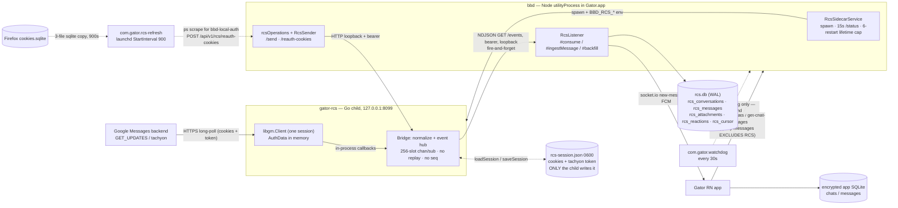

# RCS bridge — outage post-mortem + architecture audit (2026-07-27)

*A 65-agent audit of the RCS path across all three repos (`bluebubbles-rn`, `bluebubbles-server/packages/bbd`,
`bluebubbles-server/packages/rcs-sidecar`) plus the pinned libgm source
(`go.mau.fi/mautrix-gmessages@v0.2605.0`). 53 findings were raised; 41 survived adversarial verification
against the code and against read-only prod evidence, 12 were refuted. Every finding below carries the
VERIFIED wording — several original claims were narrowed or demoted, and those corrections are stated
inline. Companion docs: `docs/RCS_SEND_RELIABILITY.md` (the send chain, hardened 2026-07-22/23),
`bluebubbles-server/docs/RCS_RUNBOOK.md`.*

## Executive summary

RCS receive has been dead on prod (`bubbles@192.168.1.11`) since **2026-07-23 12:09**, and it stayed dead
across two full Gator restarts, 393 automated repair attempts and four days, with **no alert on any
channel** and three separate status surfaces reporting it as "starting". The proven mechanism is a
credential deadlock: `gator-rcs` treated a failed Google `Connect()` at boot as `log.Fatal`, and did so
**before** it bound its loopback listener — so an expired Google session made the process un-bootable, and
the only route that can install fresh cookies (`POST /reauth-cookies`) is served by that same process.
Expired credentials therefore meant "cannot boot", which meant "cannot accept new credentials". The
15-minute cookie LaunchAgent delivered a perfectly good, freshly-rotated cookie set every tick into a
socket nobody was listening on; bbd rejected all 393 of them at `ensureUp()` and returned a generic 500
reading *"Give it a moment after enabling, then retry."*

What made it **permanent** is fully explained. What made it **start** on Jul 23 is not — see §3. The
deeper finding is structural and independent of this incident: the control plane (repair, alerting,
liveness proof) was built *inside* the failure domain, and the data plane is push-only with no
reconciliation of any kind — an RCS message exists in the database if and only if a TCP stream happened
to be open at the instant Google pushed the frame.

**Status as of writing:** the whole "stop the bleeding" set (§6.1 items 1-8) exists as **uncommitted
working-tree changes** across `packages/rcs-sidecar/{main,bridge}.go`,
`packages/bbd/src/{rcs/RcsSidecarService.ts, api/operations/rcsOperations.ts, backend.ts}`,
`docs/ops/gator-watchdog.sh`, and this repo's `src/core/realtime/rcsHealth.ts`. Of the structural
findings only 8c (the unlocked `json.Marshal(sess)` over libgm's shared cookie map) is untouched.
Nothing is committed, built into the packaged binary, or deployed. Prod is still down: `pgrep gator-rcs`
returns nothing and the reauth log is still appending 500s.

## 1. Incident timeline

All times America/Denver unless the line is quoted from a UTC-stamped log. Every row is from a file read
read-only on prod or from a repo file.

| When | What | Source |
|---|---|---|
| 2026-07-22 13:13:18 | Newest message ever stored in `rcs.db` — ingestion stops here | `rcs.db` `rcs_messages` MAX(ts) |
| 2026-07-23 11:41:38 | `reauth OK (HTTP 200) {"reauthed":true,"connected":true,"ok":true}` | `~/Library/Logs/gator-rcs-refresh.log:1496` |
| 2026-07-23 11:56:39 | **Last successful reauth.** Same 200 + `connected:true`. `rcs-session.json` written (mtime 11:56, `tachyon_expiry = 2026-07-24T02:41:08.694964Z`) | log:1497; session file |
| 2026-07-23 12:08:30 → 12:09:41 | `daemon ping failed (1/3)`, `(2/3)`, `(3/3)` | `~/Library/Logs/gator-watchdog.log` |
| 2026-07-23 12:09:41 | `daemon unresponsive after 3 consecutive pings — restarting Gator` → `pkill -TERM`/`-KILL -f "$APP/Contents/MacOS/Gator"`, `lsof -ti TCP:1235 \| kill -9`, `open "$APP"` | `~/bin/gator-watchdog.sh:39,42,47,48` |
| 2026-07-23 12:11:39 | **First failure.** `reauth FAILED (HTTP 500): {"error":{"message":"The RCS sidecar is not running yet. Give it a moment after enabling, then retry."}}` | log:1498 |
| 2026-07-24 02:41:08Z | `tachyon_expiry` lapses. From ~01:41Z every boot is forced into a live token refresh with Jul-23 cookies | libgm `client.go:104` `RefreshTachyonBuffer = 1h` |
| 2026-07-26 16:19:20 | Gator reinstalled + launched. Sidecar spawns and dies 6 more times in 62 s; supervisor gives up | bbd log ring (§2) |
| 2026-07-23 → 07-27 | 393 consecutive identical HTTP 500s, one every 15 min. Nothing escalates | `gator-rcs-refresh.log` (`grep -c "HTTP 500"` = 393) |
| 2026-07-27 14:13:23 | Still failing. `pgrep -fl gator-rcs` → nothing | live check |

Note the two gaps do **not** line up: ingestion stopped ~23 h *before* the process died, while reauth was
still reporting `connected:true`. That discrepancy is unresolved (§3).

## 2. The proven root-cause chain

Recovered verbatim from bbd's in-memory log ring (`get-logs` admin channel, read-only) during the audit —
the Jul-26 16:19 boot, timestamps UTC:

```
22:19:22.061  starting rcs sidecar: …/gator-rcs (port 8099, session …/rcs-session.json)
22:19:22.319  [rcs-sidecar] FTL Bridge startup failed
              error="failed to connect with saved session: failed to refresh auth token:
                     HTTP 401: 16: Request had invalid authentication credentials. Expected OAuth 2…"
22:19:22.320  rcs sidecar exited (code 1)
              … identical failure at attempts 1-6 (1s, 2s, 4s, 8s, 16s, 30s backoff) …
22:20:24.602  rcs sidecar gave up after 6 restart attempts
22:27:59.649  operation "rcs-reauth-cookies" failed RcsUnavailableError:
              The RCS sidecar is not running yet.
```

The chain, each link read in source (line numbers as of the audit, i.e. **before** the in-flight P0 patch):

1. **libgm forces a live refresh once the token is within an hour of expiry.** `Connect()` calls
   `refreshAuthToken` and propagates its error (`libgm/client.go:212-231`); `refreshAuthToken`
   short-circuits to `nil` only while `time.Until(TachyonExpiry) > RefreshTachyonBuffer`
   (`client.go:417-418`, `RefreshTachyonBuffer = 1 * time.Hour` at `client.go:104`). Past that it POSTs
   `RegisterRefresh` **using the stored cookies**. Prod's cookies were last known-good Jul-23 11:56;
   Google answered `HTTP 401 … invalid authentication credentials`.
2. **`Bridge.Start()` returned that error.** It tolerated exactly one failure — a *missing* session file
   (`errors.Is(err, os.ErrNotExist)` → `StateAwaitingCookies; return nil`, `bridge.go:152-158`). A session
   that loads but cannot connect returned `fmt.Errorf("failed to connect with saved session: %w", err)`
   (`bridge.go:174-176`).
3. **`main()` turned it into `os.Exit(1)`.** `if err := bridge.Start(); err != nil { log.Fatal()… }`
   (`main.go:61-64`) — zerolog `Fatal` is `os.Exit(1)`, ~250 ms after spawn.
4. **The listener never bound.** `net.Listen("tcp", addr)` was at `main.go:71`, *after* `Start()`. So
   `POST /reauth-cookies` (`server.go:37` → `handleReauthCookies`, `server.go:127`) and `POST /pair/start`
   physically did not exist. Nothing was listening on 8099.
5. **bbd's supervisor abandoned it 62 s later.** `#MAX_RESTARTS = 6` with
   `Math.min(30_000, 1000 * 2 ** n)` backoff (`RcsSidecarService.ts:93,239-243`); `#restarts` resets in
   exactly one place — inside the 15 s `/status` poll (`:228`), which early-returns while `#child` is null
   (`:223`). A child that never answers `/status` can never clear the counter.
6. **The repair endpoint is gated on the dead process.** `ensureUp(deps)` is the *first* statement of the
   `rcs-reauth-cookies` handler (`rcsOperations.ts:208`), throwing at `:56-58` whenever
   `deps.rcs.isRunning()` (literally `this.#child != null`, `RcsSidecarService.ts:133-135`) is false —
   before `input.cookies` (read only at `:218`) is stored or forwarded anywhere. There is **no cookie
   store in bbd at all**: `configSchema.ts:121-122` has only `rcsEnabled`/`rcsPingMinutes`, and the sole
   durable copy of the cookies is `rcs-session.json`, written exclusively by the sidecar's own
   `saveSession()` (`bridge.go:196-234`). The payload is discarded unread.
7. **The failure is mislabelled at every surface.** `RcsUnavailableError` carries no numeric `.status` and
   is not a `BridgeUnavailableError`, so it misses both mapping branches and falls through to
   `failure(500, …)` (`execute.ts:162-163`) — a generic *server fault*, not a retryable 503 the caller
   could classify. Meanwhile `/api/v1/rcs/status` returns `state:"starting"` (`rcsOperations.ts:128-130`)
   and the app's Server Health row collapses `running === false` into
   `{severity:'warn', status:'Starting', detail:'RCS bridge is starting…'}` (`src/core/realtime/rcsHealth.ts:139-141`).

**The counterfactual is exact:** had the listener bound unconditionally, the *existing, already-deployed*
15-minute LaunchAgent would have self-healed the bridge within one cycle. `ReauthCookies` gates on
`isPairedLocked()` (`bridge.go:693-695` = `cli != nil && sess != nil && sess.Browser != nil`), which
`Start()` already satisfies at `:165-172` **before** `Connect()` — so a `StateFailed`-but-alive bridge
would still have accepted the fresh cookies.

### What is already fixed (in-flight, not shipped)

All eight "stop the bleeding" items (§6.1 items 1-8) have landed **as uncommitted working-tree changes**:

- **Sidecar** (`{main,bridge}.go`) binds the listener first and never returns an error from `Start()` for
  a credential problem — a connect failure records `state = StateFailed` + `lastError`, keeps `sess`/`cli`
  populated so `isPairedLocked()` still holds, broadcasts `GAIA_LOGGED_OUT`, and returns `nil`. A corrupt
  or unreadable session is likewise non-fatal, and deliberately lands in `StateFailed` rather than
  awaiting-cookies so `/pair/start` cannot overwrite a session that may be recoverable.
- **Supervisor** (`RcsSidecarService.ts`) replaces the lifetime `#MAX_RESTARTS = 6` with a rolling window
  (`RESTART_WINDOW_MS`/`MAX_RESTARTS_IN_WINDOW`) plus a slow revival ladder (5→10→20→40→60 min) that never
  gives up; adds `onFault` (supervisor-driven alerting), `stageCookies()`, `refresh()`, `onSlowLadder`,
  `lastExitReason`, and settles `error` and `exit` through one path so an ENOENT spawn can no longer wedge
  `#child` non-null forever.
- **Operations** (`rcsOperations.ts`) — `RcsUnavailableError.status = 503`; `rcs-reauth-cookies` no longer
  calls `ensureUp` but stages the cookies and returns HTTP **200** with `{reauthed: false, staged: true}`;
  `rcs-status` returns `state: "failed"` + `error` once the supervisor is on the slow ladder.
- **Watchdog** (`gator-watchdog.sh`) probes RCS liveness (detect + `osascript` notify, not restart) and now
  also reaps an orphaned `gator-rcs` and clears TCP:8099 when it restarts Gator — see §1.
- **App** (`src/core/realtime/rcsHealth.ts`) no longer renders a green "Connected" from no information, and
  reports a crash-looping sidecar as `Not running` rather than `Starting…`.

**Two things still gate deployment.** The tracked `packages/rcs-sidecar/gator-rcs` was rebuilt locally and
then restored, but the copy packaging actually ships —
`packages/server/appResources/macos/daemons/gator-rcs/arm64/gator-rcs` — is still the Jul-19 build, so
`shipped-sidecar-binary-is-a-stale-checked-in-build` still applies: the sidecar must be rebuilt **and
codesigned** before any of this reaches prod. And nothing here is committed.

## 3. What is still unknown — the Jul-23 onset

**The audit did not establish what killed the sidecar on 2026-07-23, and this report does not guess.**

The fatal-`Connect()` defect explains why the outage became permanent and unrepairable, but it **cannot**
explain the first death. The watchdog restarted Gator at 12:09:41 after `daemon unresponsive after 3
consecutive pings`; the first 500 follows at 12:11:39. At that moment `tachyon_expiry`
(`2026-07-24T02:41:08Z`) was still ~8.5 h away — comfortably outside `RefreshTachyonBuffer = 1h`
(`client.go:104`) — so `refreshAuthToken` would have returned `nil` at `client.go:418` with **no network
call at all**, and `Connect()`'s only remaining work is `go c.doLongPoll(…)`. The fatal-connect path could
not have fired on that boot.

That boot's logs are gone. `persistLogs` is explicitly `false` in prod's config blob, so
`createFileLogSink` is never constructed (`backend.ts:401`); the only always-on sink is a 500-entry
in-memory ring (`daemon-entry.ts:17`), and a process restart destroys it. `~/Library/Logs/Gator` holds
only a Jul-8 `startup-error.log`. The unified-log archive contains **zero** `gator-rcs` rows between
2026-07-22 00:00 and 2026-07-26 16:19.

Two things remain genuinely open:

- **What killed it.** One unverified candidate worth checking first: the watchdog's
  `pkill -f "$APP/Contents/MacOS/Gator"` (`gator-watchdog.sh:39,42`) does **not** match the sidecar's argv
  (`…/daemons/gator-rcs/arm64/gator-rcs`), and its orphan sweep clears only `TCP:1235` (`:47`) — so an
  orphaned `gator-rcs` could have survived the kill still holding port 8099, and a bind failure is *also*
  `log.Fatal` (`main.go:72-74`). This is a hypothesis; it was not confirmed, and no other candidate was
  excluded either.
- **The 23-hour pre-death ingest stall.** `rcs.db`'s newest message is 2026-07-22 13:13:18, yet reauth
  reported `connected:true` until 2026-07-23 11:56. Either the bridge was alive-but-deaf for a day, or
  that is an ordinary quiet period — one verifier measured this user's inter-message gaps at 15-29 h and
  judged it within the normal distribution. Unresolved. There is no ingestion-liveness signal anywhere in
  the system that could settle it (the sidecar's 20 s `/events` heartbeat is discarded at
  `RcsListener.ts:310-312` and nothing tracks last-line-received), which is itself the finding.

## 4. Architecture critique

### 4.1 What the architecture is today

RCS rides a five-hop, single-direction push pipeline with no reconciliation anywhere in it. A Go child
process (`gator-rcs`) embeds `libgm` and holds exactly one Google "Messages for Web" companion session,
whose credentials (Google cookies + a 24 h tachyon token) live in `rcs-session.json` — a file **only the
child ever writes** (`bridge.go:196-234`). Google delivers frames over libgm's HTTPS long-poll; the child
re-publishes them as NDJSON on a loopback `GET /events` stream (`bridge.go:1268-1299`) with no sequence
number, no ack, no persistence and a 256-slot per-subscriber buffer that drops-and-logs. bbd's
`RcsListener` consumes that stream and writes into a **second, private** `rcs.db` (`backend.ts:437`,
tables at `RcsCacheStore.ts:43-63`) that is entirely separate from `chat.db` and from every piece of sync
machinery the iMessage path has. The app then sees RCS only through `get-chats`/`get-chat-messages` plus
live socket/FCM fanout — its own incremental cursor endpoint deliberately excludes RCS
(`readOperations.ts:357-364`). Auth is replicated in from a *different* Google session: a 15-minute
LaunchAgent copies Firefox's `cookies.sqlite`, scrapes bbd's admin token out of `ps -Aww -o command`
(`gator-rcs-refresh.py:73-78`), and POSTs the cookies into a route gated on the child being alive
(`rcsOperations.ts:56-58`).



### 4.2 Flaw 1 — the control plane was built *inside* the failure domain

Three independent supervisory functions all route through the component being supervised:

- **Repair.** `POST /reauth-cookies` — the only way to install fresh cookies — is served by the sidecar
  itself and is additionally gated on `deps.rcs.isRunning()` (`rcsOperations.ts:56-58`,
  `RcsSidecarService.ts:133-135`). The 393 HTTP 500s in the LaunchAgent log are that single line.
- **Alerting.** `notifyBridgeDown` is reachable only from `RcsListener.#handleAlert`, i.e. only from an
  `alert` **line on the sidecar's own `/events` stream**, and `#runForever` refuses to open that stream
  unless `source.isRunning()` (`RcsListener.ts:208-229, :234`). The one user-facing outage push is
  structurally incapable of firing for the worst outage.
- **Liveness.** `main()` called `cli.Connect()` **before** `net.Listen` (`main.go:61-64` vs `:71`) and
  treated any error as `log.Fatal`. So an expired credential meant the HTTP surface never bound, which
  meant the repair route did not exist, which meant the credential stayed expired.

Every affordance added for robustness was placed downstream of the same single point of failure. The
supervisor cannot write the child's credential (only `saveSession` does), cannot distinguish "spawning"
from "abandoned" (`rcsOperations.ts:127-130` returns `state:"starting"` forever), and gives up permanently
62 s after the first crash. There is no `config-changed` hook for `rcsEnabled` either — `backend.ts` wires
hooks only for `enablePrivateApi` (`:354`), `hideDockIcon` (`:361`), `autoCaffeinate` (`:820`) and
`autoStartMethod` (`:840`) — so the obvious operator remedy (toggle it off and on) does nothing.

**Is a supervised child with a private SQLite the right shape?** The **child process is right** — libgm is
Go, process isolation contains its panics (the sidecar has exactly one `recover()`, `server.go:69-79`,
covering only HTTP request goroutines), and it mirrors `ZrokTunnel`. Three choices *inside* that shape are
wrong:

1. **The restart policy was cloned from the wrong precedent.** `RcsSidecarService` is a near-copy of
   `ZrokTunnel` (`ZrokTunnel.ts:55,136-144` — same cap, same backoff). A lifetime cap is defensible for
   zrok because a dead tunnel is *loud*: the server becomes unreachable and a human notices in minutes. A
   dead RCS bridge is *silent* — iMessage keeps flowing and only RCS threads quietly stop. The correct
   shape already exists one package over: `packages/server/src/main.ts:123-126` uses
   `RESTART_WINDOW_MS = 60_000` + `MAX_RESTARTS_IN_WINDOW = 5` + a backoff ladder — a **rolling window**,
   not a lifetime budget.
2. **The child owns the durable credential.** A supervisor that cannot write its child's credential can
   never repair it. `rcs-session.json` should be owned by bbd (which already owns `userData`, `config.db`
   and the per-boot secret) and handed to the child at spawn.
3. **The private `rcs.db` is a second source of truth with none of the sync machinery.** Keeping it as a
   cache is fine; keeping it as a cache *with its own bespoke cursor semantics and no monotonic sequence*
   is what makes catch-up impossible (Flaw 3).

**Correct design.** Bind the socket first and treat Google connectivity as a *runtime state*, not a
startup precondition — the exact treatment a *runtime* cookie expiry already gets (`bridge.go:1181-1190`
logs and broadcasts; it does not exit). Move credential custody up to the supervisor. Drive alerting from
the supervisor's own observation ("child not running", "no frame in N minutes"), never from the child's
stream. Give the service a `refresh()` + `config-changed` hook exactly like `CaffeinateService`
(`backend.ts:813-822`).

### 4.3 Flaw 2 — auth is unowned credential *replication* between two live Google sessions

Firefox owns one Google session; libgm owns another and keeps its own cookie map current by merging every
`Set-Cookie` it sees (`UpdateCookiesFromResponse`, `client.go:71-80`). The refresh script then **wholesale
replaces** libgm's self-maintained map with Firefox's — `sess.SetCookies(cookies)` is a replace, not a
merge (`client.go:50-54` aliases the map by reference) — every 15 minutes, forever. Two clients rotating
`__Secure-1PSIDTS`/`SIDCC` on the same account can invalidate each other, and neither side can detect it.

The scrape ships *every* `%google.com` cookie (`gator-rcs-refresh.py:51-53` — ~30 names including `NID`,
`AEC`, `OTZ`, `SIDCC`), so the churn-avoidance guard `cookiesEqual(b.lastCookies, cookies)`
(`bridge.go:355-361`) almost never matches and the code takes `cli.Reconnect()` — a real teardown of a
working long-poll — on nearly every tick. That is ~96 self-inflicted `connected:false` windows per day,
each one a hole in a stream with no replay. (Verification narrowed the *mechanism* here: the original
claim that `b.lastCookies` records libgm's post-rotation values is **wrong** — the clone at `bridge.go:376`
wins the race by orders of magnitude. The guard fails for a simpler reason: Google re-sets the high-churn
`*SIDCC`/`*SIDTS` cookies in Firefox's own jar continuously, so an exact whole-map match essentially never
holds. Consequences are bounded — unacked inbound frames are redelivered after reconnect — so this is
churn, not message loss.) The transport is equally unowned: a three-file `shutil.copy` of a live WAL
database (`py:46-49`), and a token picked by *length* from the system-wide process table (`py:73-78`).

**Is the cookie-scrape model salvageable, or is it the root disease?** It is **not the root disease, but it
is the wrong role for the cookie.** libgm's actual live credential is the tachyon token (24 h TTL,
self-refreshing at T−1h, `client.go:104,417-418`); the cookies are only needed to *renew* it. Treating
them as a 15-minute heartbeat inverts that: it makes a bootstrap credential into a continuous write-path
into live session state, with the noisiest possible payload. The salvageable design:

- Cookies become a **recovery credential**, stored durably by bbd, applied only when the sidecar reports it
  cannot refresh (or on a cadence measured in hours, not minutes).
- Narrow the scrape to the auth-identity set (`cookies.go:12` requires `SID/HSID/SSID/OSID/APISID/SAPISID`;
  the Python `REQUIRED` at `py:30` is missing `OSID` — align them) so the skip guard actually fires.
- Replace both side channels: bbd writes the local token to a 0600 file in `userData` instead of hoping it
  appears on a renderer's argv; the cookies arrive via the dashboard or a staged file rather than a POST
  into a live process.

What is genuinely unfixable is that this depends on a human keeping a normal Firefox window logged into
`messages.google.com` indefinitely, with the failure mode being one line in an unrotated log. That is a
documented operational contract at best — not something to build a message transport's availability on.

### 4.4 Flaw 3 — ingestion is push-only: five layers, and not one can answer "what did I miss?"

This is the reason messages go missing, independent of the outage. Every layer is fire-and-forget:

| Layer | Gap |
|---|---|
| `broadcast` (`bridge.go:1268-1299`) | No seq, no ack, no replay. Drops on a full 256-slot channel with a warn. **No-ops entirely with zero subscribers.** |
| Conversation discovery | ONE snapshot per *process*, fired 3 s after `Start()` (`bridge.go:178, :1219-1231`) — before the listener binds — hardcoded to the newest 25 INBOX threads. `GET /conversations` (`server.go:40`) exists and has **zero callers in bbd**. |
| Reconnect | `ReauthCookies` (`bridge.go:332`) and `reconnectForAuth` (`:575`) only call `cli.Reconnect()`. `snapshotConversationsAfter` has exactly two call sites (`:178`, `:286`). A reconnect resumes **live-only**. |
| Backfill | Triggered only by a `ready` line (`RcsListener.ts:295-303`) and `continue`s past `backfilledComplete` (`:522-524`). `setCursor(convId, null, true)` (`:555`) is a **one-way latch** — nothing in the repo ever writes 0. Prod: 31 of 33 conversations already latched. |
| App | Its incremental cursor endpoint excludes RCS by design (`readOperations.ts:357-364`), and the 15-min background task runs only `incrementalSync` + `runOutgoingQueue` (`backgroundSync.ts:41-55`). A foreground sync recovers **one message per chat** (the embedded `lastMessage`, `engine.ts:118-150`). |

So an RCS message exists in your database if and only if a TCP stream happened to be open at the instant
Google pushed the frame. Everything else — 5 s reconnect gaps, buffer overruns, a boot race, four days of
downtime — is loss.

**Two verification corrections that narrow the blast radius, and neither rescues the design:**
(a) the latch only shuts out conversations that *already* have `backfilled_complete = 1`. A conversation
with **no** `rcs_cursor` row is not skipped (`RcsListener.ts:522-523` falsy-checks `state?.backfilledComplete`)
and *is* paged from the newest end up to 200 messages — prod has 33 conversations, 31 cursor rows, 2
orphans, so a brand-new thread is in the one category the latch does not break, provided it lands in the
25-conversation snapshot window. (b) "no catch-up exists" is false as an absolute: libgm replays Google's
queued un-acked updates at long-poll (re)connect (`skipCount`, `longpoll.go:512` →
`event_handler.go:202-204`), and the `MessageEvent` branch forwards them even when `IsOld`
(`event_handler.go:262-273`) — unlike the conversation/typing/alert branches, which drop old events. The
sidecar rebroadcasts those as ordinary `message` lines (`bridge.go:1129-1131`). Queue depth and TTL are
Google-controlled and unknowable from this code. So the accurate claim is: **recovery of a gap for the 31
latched conversations is unreliable and unengineered — it depends entirely on Google's replay queue, and
nothing in Gator will page the gap deterministically.**

**Correct design — and this repo already has the pattern.** The app's `outgoing_queue` is a proper
reconciler: lease (`claimOutgoing`, `outgoing.ts:916-919`), eligibility scan (`listRetryableOutgoing`,
`:900-908`), backoff (`outgoingBackoffMs`, `:710`), attempt cap (`:702`) and explicit retirement
(`retireOutgoing`, `:686`). Invert it for ingestion:

1. **Redefine the cursor.** `backfilled_complete` should mean "history complete **backward** from T", not
   "never look again". Add `last_seen_ts`/`last_seen_id` to `rcs_cursor` (`RcsCacheStore.ts:61-63,264-276`).
2. **Forward sweep on every `/events` (re)connect.** Call the already-existing, unused `GET /conversations`
   (with a count derived from the cached conversation count, not a hardcoded 25), then page
   `GET /conversations/:id/messages` newest-first per conversation, stopping at the first `messageID`
   already in `rcs_messages`. Fan out newly-discovered rows with `push:false` so recovery is not a
   notification storm. (Because a `backfilled_complete` conversation has `cursor = NULL`, simply *not
   skipping* it makes `#backfillOne(convId, undefined)` start from the newest page — so a
   stop-at-first-known-id sweep needs no new column at all.)
3. **Emit `ready` per `/events` SUBSCRIPTION**, not once per process (`server.go:415-455` already primes a
   heartbeat on subscribe). That deletes the boot race outright.
4. **Sequence the stream.** A monotonic `seq` on every broadcast line + a gap check in `#handleLine` turns
   today's silent drop into a detectable "request resync".
5. **Persist `#syntheticConv`** at `RcsListener.ts:366` so a message-first thread becomes a real chat.
6. **Give the app a real RCS cursor** — a monotonic local rowid on `rcs_messages` exposed through
   `query-messages`, or a sibling `rcs-query-messages`. Until then the app's own backstop is blind to RCS
   by construction.
7. **Bound the RPCs.** `ListConversations` (`bridge.go:743`) and `FetchMessages` (`:765`) are the only
   libgm calls not wrapped in `callRPC`, and libgm's wait is unbounded; `#fetchPage`
   (`RcsListener.ts:570-581`) and `RcsMediaCache.#fetchMediaBytes` (`:193`) carry no `AbortSignal`.

### 4.5 Direct answers to the three complaints

**"Messages go missing."** Not a bug — a missing subsystem: the RCS path has **no reconciliation of any
kind**, so a message exists only if a TCP stream happened to be open the instant Google pushed it
(`bridge.go:1268-1299` has no seq/ack/replay), and every catch-up mechanism is a one-shot latch
(`RcsListener.ts:522-524`; `snapshotConversationsAfter` fired once per process at `bridge.go:178`).
`3023082950` is absent from `rcs.db` entirely because a first-ever conversation is discoverable *only* by a
live frame or the once-per-process top-25 snapshot — and nothing has been running since ~2026-07-23.

**"The cookie times out and nothing retries."** Correct, and worse: the only retry is launchd's 900-second
tick (no `KeepAlive`, no `ThrottleInterval`), every failure path in the script is a bare `return 1`
(`py:85/89/94/110/113`), the one sub-tick self-heal reconnects with the **stored** cookies
(`bridge.go:568-592`) so it can never fix an expired one — and the repair endpoint is gated on the very
process a stale credential kills (`rcsOperations.ts:56-58` + `main.go:61-64`), so 393 perfectly good cookie
sets were discarded unread.

**"The architecture."** The child-process shape is right; what was built around it is not. The control
plane — repair, alerting, liveness proof — was placed *inside* the failure domain, so the system can
neither notice nor fix its own outage; and the data plane is push-only with a private database that has
none of the sync machinery the iMessage path has, so nothing can ever ask "what did I miss?". Two of the
three correct patterns already exist in these repos and were simply not applied here: the rolling-window
restart policy at `packages/server/src/main.ts:123-126`, and the lease/backoff/attempt-cap reconciler at
`src/db/repositories/outgoing.ts:686-921`.

## 5. Confirmed findings (41)

Grouped by the severity **as raised**, so the counts are traceable to the source audit; where verification
demoted or narrowed a finding, the corrected severity and the correction are stated inline — **the
corrected wording is the operative one.** Several findings are independent rediscoveries of the same
defect by different agents; those are cross-referenced. Sidecar line numbers are as of the audit, i.e.
*before* the in-flight P0 patch, which shifts `main.go`/`bridge.go` by roughly +36 lines.

### 5.1 Critical (15)

#### `sidecar-fatal-start-auth-deadlock` — *sidecar-go*
A failed Google `Connect()` at boot is `log.Fatal`, so an expired session makes the sidecar un-bootable —
and the only repair endpoint lives inside the process that cannot boot.
**Location** `packages/rcs-sidecar/main.go:61-64`; `bridge.go:149-179`; libgm `client.go:212-231,417-418,104`.
**Mechanism** `Start()` tolerates only a *missing* session file; a session that loads but cannot connect
returns an error, which `main()` turns into `os.Exit(1)` ~250 ms in — before `net.Listen` at `main.go:71`.
The HTTP surface, including `POST /reauth-cookies`, never binds.
**Fix** Bind the listener unconditionally; on a `Connect()` error record `state = StateFailed` +
`lastError` and return `nil`, keeping `sess`/`cli` so `isPairedLocked()` holds. Treat a corrupt session as
repairable, not fatal. **✅ implemented in the working tree; not committed or deployed.**
**Corrected** This is the **perpetuator, not the initiator** — see §3. It makes every boot from
2026-07-24 01:41Z onward deterministically fatal, which the Jul-26 log proves six times over; it cannot
explain the Jul-23 death. It is also **necessary but not sufficient**: the supervisor still gives up after
6 restarts within a lifetime.

#### `sidecar-connect-failure-is-fatal` — *sidecar-go* *(same defect, independently found)*
`gator-rcs` `log.Fatal()`s when it cannot resume a saved session, guaranteeing the 6-restart cap is hit.
**Location** `main.go:60-64`; `bridge.go:149-180` (esp. `:174-176`); libgm `client.go:212-233,417-420`.
**Mechanism** As above. **Fix** As above.
**Corrected** Same scoping: perpetuator only. Additionally, **token expiry is necessary but not
sufficient** — renewing an expired tachyon token is `refreshAuthToken`'s entire job; the `log.Fatal`
requires Google to actually *reject* the POST. And one cited piece of evidence is invalid: a Go panic exits
via the runtime, not a signal, so an empty `~/Library/DiagnosticReports` does **not** distinguish a panic
from `log.Fatal`.

#### `reauth-cookie-deadlock` — *bbd-server*
The cookie-refresh repair path is gated on the very process it repairs; 393 valid cookie sets discarded unread.
**Location** `rcsOperations.ts:52-59,208`; `RcsSidecarService.ts:133-135`.
**Mechanism** `ensureUp(deps)` is the first statement of the handler, ahead of the only use of
`input.cookies` (`:218`). There is no cookie store anywhere in bbd; the only durable copy is
`rcs-session.json`, written solely by the sidecar. The throw surfaces as a generic 500, not a 503.
**Fix (as implemented)** Hold the cookies IN MEMORY on the supervisor (`stageCookies()`) and return HTTP 200 with `{reauthed: false, staged: true}` when the child is
down; apply staged cookies at next `start()`. Give `RcsUnavailableError` a numeric `.status = 503`.
**Corrected** Keep the mechanism, **drop the causal loop.** "The sidecar is down BECAUSE its cookies are
stale" is contradicted by the timeline: the cookies were 13 minutes old and confirmed working
(`connected:true`) when it died. Staging alone would **not** have self-healed prod — it only takes effect
at the next process start, and there was no next child after the give-up.

#### `reauth-cookie-deadlock` — *cross-cutting* *(dup)* · `reauth-is-deadlocked-behind-the-process-it-repairs` — *bbd-server* *(dup)*
Same defect from two other angles. Adds: **all three** RCS repair ops are gated — `rcs-reauth-cookies`
(`:207-208`), `rcs-pair-start` (`:181`) and `rcs-unpair` (`:241`) — so dashboard re-pairing is equally
locked out.
**Corrected** The accurate framing is a **ratchet**, not a cookie-specific cycle: whatever kills the
sidecar, recovery is impossible without restarting Gator, because the repair ops are `ensureUp`-gated, the
lifecycle supervisor never restarts a service (`core/lifecycle.ts:69-75`), the in-process restarter gives
up permanently, and the dashboard exposes no restart control (`RcsActions.ts:31,34,42`). Of the three
proposed fixes, **only "make `Connect()` non-fatal" is independently sufficient** — staging cookies needs a
next child that never comes *and* a new sidecar boot contract (`main.go:38-43` reads only
`BBD_RCS_PORT/SECRET/SESSION_FILE/LOG_LEVEL`); a revival timer alone just respawns a child that dies
identically.

#### `supervisor-permanent-giveup` — *bbd-server*
The supervisor abandons the sidecar forever after 6 restarts in ~62 s, and the counter can only be reset by
the dead child itself.
**Location** `RcsSidecarService.ts:93,205-210,220-234,237-254`; `backend.ts:1313`.
**Mechanism** `#MAX_RESTARTS = 6`, backoff 1/2/4/8/16/30 s = 61 s. `#restarts = 0` appears in exactly one
place (`:228`), inside the `/status` poll that early-returns while `#child` is null (`:223`). Nothing else
calls `start()`; there is no `config-changed` hook for `rcsEnabled`.
**Fix** Rolling window (`packages/server/src/main.ts:123-126` shape) + a slow infinite revival ladder;
`rcsEnabled` config-changed hook; expose `gaveUp`/`restarts` on `rcs-status`.
**Corrected** **Demoted from acute cause to high robustness defect.** The give-up does not survive a
process restart (`#restarts` is per-instance), and prod restarted at least twice in the window while the
sidecar still never came up. It removes ~62 s of intra-process self-healing and hides the state — it is not
what made the outage four days long.

#### `sidecar-supervisor-terminal-give-up` — *bbd-server* *(dup)*
Same defect. Behavior is deliberate and **pinned by a test**: `packages/bbd/test/rcsSidecar.test.ts:117-128`
asserts `spawns() === 7`.
**Corrected** Same demotion. Also: `health()` (`:273`) *does* return `{ok:false}` and `get-rcs-status`
*does* report `running:false` — the real gap is that `daemon.health()` (`bootstrap/daemon.ts:56`) has **no
production caller anywhere**, so the abandoned state is unobservable rather than unexposed. Provable
crash-loop window is ~21 h (the Jul-26 boot), not 4 days.

#### `start-called-once-no-restart-trigger` — *bbd-server*
`start()` is the only external call site — no config hook, no admin command, and app "restart" replays the
same 62-second crash loop.
**Location** `backend.ts:1297-1317,:354,:361,:820,:840`; `core/lifecycle.ts:38-52`;
`packages/server/src/main.ts:322-327,:348-350`.
**Mechanism** `start()` is `async` and awaits nothing after `#spawn`, so the child's death ~200 ms later is
structurally invisible to `Supervisor.start()`. Exactly four `config-changed` hooks exist; none is
`rcsEnabled`. `hot-restart`/`full-restart` relaunch the whole app and re-run the identical loop.
**Fix** Add an `rcsEnabled` `config-changed` hook + `RcsSidecarService.refresh()`, and an
`rcs-restart-sidecar` admin op.
**Corrected** `#scheduleRestart` calls `this.start()` internally (`:249`) — say "the only call site outside
the service's own restart timer". Two admin commands do exist: `soft-restart`
(`adminCommandOperations.ts:322-333`) bounces zrok with exactly the stop/start idiom the sidecar needs but
pointedly skips it — arguably the better fix site; `hard-restart` (`:337-345`) does re-arm the counter but
replays the loop.

#### `no-catchup-after-any-downtime` — *cross-cutting*
There is no catch-up: a recovered sidecar resumes live-only, and every server- and app-side backfill route
is latched shut.
**Location** `bridge.go:178,286,332,575,1219-1231`; `RcsListener.ts:295-303,516-529,553-561`;
`readOperations.ts:290-303,346-356`; app `src/services/background/backgroundSync.ts:41-48`.
**Mechanism** `backfilled_complete` is a one-way latch (`setCursor` is written at only two sites, neither
of which writes 0); reauth/reconnect never re-snapshot; `query-messages` deliberately excludes RCS; per-chat
`ensureChatSynced` for an `RCS;-;` guid is served from the same empty cache.
**Fix** Resume-from-watermark forward sweep on every `/events` (re)connect (§4.4 item 2), `push:false` fanout.
**Corrected** Narrowed twice: the latch only shuts out conversations that already have a cursor row (2 of
33 prod conversations, plus every new thread, are *not* latched); and libgm's queued-update replay means
"lost forever" is not established. Corrected claim: **recovery for latched conversations is unreliable and
unengineered — it depends entirely on Google's replay queue.** The proposed fix works as written and needs
no new column.

#### `cannot-recover-without-human-summary` — *cross-cutting*
The sidecar cannot return without a human; seven independent silence gaps sit between "died" and "anyone
finds out".
**Location** `RcsSidecarService.ts:239-241,:228`; `main.go:61-64`; `rcsOperations.ts:56-58`;
`backend.ts:1313,:354/:361/:820/:840`.
**Mechanism** Recovery needs both (a) something calling `start()` again and (b) `cli.Connect()` succeeding.
(a) is impossible in-process; (b) is impossible without new cookies, which can only arrive through a route
gated on the process being alive.
**Fix** The six-item minimum viable set → §6.
**Corrected** Evidence is not "gone in seconds" — the 500-entry ring survived 21 h and yielded the verbatim
`FTL Bridge startup failed` lines; the correct property is *never written to disk, destroyed by the next
process restart*. Also: `ensureUp` is only the **outer** lock — nothing is listening on 8099 at all, so
`/reauth-cookies` and `/pair/start` are physically unreachable even if `ensureUp` were deleted. **The only
actual human recovery today is: quit the app, delete/replace `rcs-session.json`, relaunch, then pair from
the dashboard** — dashboard re-pairing alone is also `ensureUp`-gated.

#### `cookie-expiry-kills-receive-path-permanently-and-silently` — *sidecar-go* — **demoted to low/medium**
When the cookie expires with the sidecar alive, libgm's long-poll goroutine exits permanently and the
sidecar does not.
**Location** libgm `longpoll.go:378-387,:339-343,:308-317,:422`; `bridge.go:1188-1190,:624-631,:711-713,:803-829`.
**Mechanism** A 401/403 on the long-poll triggers `ListenFatalError` and `return false`, ending the
goroutine (there is no outer retry loop) and killing the ditto pinger with it. `bridge.go:1188-1190` only
logs and broadcasts — it does not reconnect and does not set `state`, so `state` stays `"paired"` and
`RcsSidecarService.health()` (which faults only on `state === "failed"`) still reports `ok:true`.
**Fix** In the `ListenFatalError`/`GaiaLoggedOut` cases call `markCookiesExpired` and start a bounded
backoff `reconnectForAuth` goroutine — the self-heal the send path already has.
**Corrected** **Demote from critical.** This is defense-in-depth, not an unbounded outage: recovery is
already automatic via `Bridge.ReauthCookies` driven by the 15-min LaunchAgent (bounded ~15 min), and the
user *is* alerted — `LISTEN_FATAL_ERROR` is in `DOWN_ALERTS` (`RcsListener.ts:38,:220-228`) and fires a
high-priority FCM push. The residual risk is that this recovery lives entirely **outside the product**.
Not the cause of this outage.

#### `reauth-marshals-the-live-cookie-map-without-the-lock` — *sidecar-go* — **latent unrecoverable crash**
`ReauthCookies` iterates libgm's **live** cookie map (`cloneCookies` + `json.Marshal`) with no
`CookiesLock`, while libgm merges `Set-Cookie` into that same map in place → Go
`fatal error: concurrent map iteration and map write` → unrecoverable `exit(2)`.
**Location** `bridge.go:365,:376,:379,:196-234` (esp. `:203`), `:733`; `cookies.go:72-81`; libgm
`client.go:46,50-54,71-80,230`; `http.go:59`.
**Mechanism** `SetCookies` does **not** copy (`ad.Cookies = cookies`), so after `bridge.go:365` the
sidecar's local map *is* `sess.Cookies`; libgm then writes it on every HTTP response
(`UpdateCookiesFromResponse`, under the write lock) while `cloneCookies` (`:376`) and `json.Marshal(sess)`
(`:203`) read it unlocked. A map write concurrent with an iteration is a runtime **throw**, not a panic —
`recover()` cannot catch it.
**Fix** `sess.SetCookies(cloneCookies(cookies))` at `bridge.go:365`, and `sess.CookiesLock.RLock()` around
the `json.Marshal(sess)` in `saveSession` (`:203`) and `SessionBytes` (`:733`). *(Verified still present in
the current tree: `bridge.go:401` `sess.SetCookies(cookies)`, `:412` `cloneCookies`, `:239`
`json.Marshal(sess)` — all unlocked.)*
**Corrected — read this one carefully.** The race is **real, critical and deployed, but it is NOT what
caused this outage.** It cannot explain six deterministic deaths inside 62 s (a probabilistic race would
not), the LaunchAgent only POSTs every 15 min so `ReauthCookies` was almost certainly never even *called*
during the restart burst, and ingestion had already stopped 23 h earlier. It is also **not
reauth-specific**: the same unlocked marshal is reached from `AuthTokenRefreshed` (`:1179`),
`PairSuccessful` (`:1154`), `reconnectForAuth` (`:603`), `Shutdown` (`:641`) and `GET /session` (`:733`),
and the always-running ditto pinger (1/min) is a far likelier racer than the freshly-spawned long-poll.
**File and ship it as crash-hardening.**

#### `bridge-down-push-requires-a-live-sidecar` — *bbd-server*
The only user-facing RCS outage push is produced by the component that is down.
**Location** `RcsListener.ts:224-227,:231-246`; `backend.ts:698-706`.
**Mechanism** `notifyBridgeDown` is invoked from exactly one place — `#handleAlert`, reachable only from an
`alert` line on `/events` — and `#runForever` opens that stream only `if (enabled() && source.isRunning())`.
**Fix** Fire `pushBridgeAlert` with a synthetic `SIDECAR_DEAD` from the give-up branch **and** from a
supervisor-level periodic check; add it to `DOWN_ALERTS`/`describeBridgeDown` (`RcsListener.ts:32-51`).
Both `pushBridgeAlert` and the app's `postStatusNotification('bb-rcs-bridge-down', …)`
(`src/services/notifications/notifeeService.ts:136`) already exist end-to-end — only the trigger is missing.
**Corrected** "The ONLY user-facing alert" → "the only user-facing **push**"; a passive (and misleading)
pull surface exists. The fix must cover **three** silence routes, not one: (a) give-up after 6 restarts;
(b) `#resolveCommand()` returning null → warn + `return` with no child *and no restart scheduled*
(`:182-187`); (c) `child.on("error")` (`:202-204`) only warns — it neither nulls `#child` nor schedules a
restart, so `isRunning()` reports **true** forever for a process that never existed.

#### `false-green-when-status-fetch-fails` — *rn-app* — **demoted to low/medium**
The app reports the RCS bridge as "Connected" (green) when it has no information at all.
**Location** `src/core/realtime/rcsHealth.ts:50-57`; `app/(app)/server-health.tsx:294-298`.
**Mechanism** `deriveRcsHealth` ends `return mapAlert(lastAlertType) ?? { severity:'ok', status:'Connected' }`
(`:57`); `mapAlert(null)` returns `null`, so "no data + no alert" renders as an affirmative green.
**Fix** Make "no evidence" a distinct state — `{severity:'warn', status:'Unknown', detail:'Could not read
RCS bridge status.'}` — and add staleness (`lastAlertAt`) as an input. Note this requires updating
`test/realtime/rcsHealth.test.ts:17-20`, which currently pins the green behavior.
**Corrected** **Not what prod shows.** Caddy allows `POST /api/v1/admin/command`, the shipped bbd
implements `get-rcs-status`, and a dead sidecar yields `running:false` → the *amber* "Starting" path
(`:139-141`), not green. The green fallback bites only when the status fetch itself fails, or on a server
built between `11af9764` and `e04f6459`.

#### `no-persistent-server-log` — *bbd-server*
There is no bbd log file on disk — the give-up warning and the sidecar's fatal error existed only in a
500-line RAM ring.
**Location** `backend.ts:397-403`; `configSchema.ts:145`; `daemon-entry.ts:17-18`;
`RcsSidecarService.ts:196-201`.
**Mechanism** `createFileLogSink` is constructed only when `config.persistLogs` is true (default `false`,
explicitly `false` in prod's config blob). The sidecar has no log file of its own: zerolog writes to
`os.Stdout` (`main.go:118-121`), which is piped straight into the same memory logger.
**Fix** Always persist **warn and above** regardless of `persistLogs` (let the flag control info/debug);
tee the sidecar's zerolog to `<logsDir>/gator-rcs.log`.
**Corrected** The ring is **not** write-only — it is readable in production via the `get-logs` admin
channel (`adminCommandOperations.ts:346-351`) and streamed as `new-log` (`backend.ts:407-410`), and at this
daemon's rate retains ~3 days. The genuine gap is that it does not survive a **process restart**, which is
exactly what erased the Jul-23 death. Also: the console tee is inert in prod because the shell forks with
`stdio:"inherit"` and the app is launched via `open` — a fix that only "prints to stderr" changes nothing.

### 5.2 High (14)

#### `new-conversation-orphaned` — *bbd-server*
A never-before-seen conversation is discovered only by a single unreplayed live frame or a once-per-process
top-25 snapshot, and a message-first discovery is never persisted as a chat.
**Location** `RcsListener.ts:292-294,355,366,496-507`; `RcsCacheStore.ts:102`;
`readOperations.ts:238-241,257-267`; `bridge.go:1221`; libgm `event_handler.go:253-260,202-206`.
**Mechanism** `#syntheticConv` builds a DTO and is never passed to `cache.upsertConversation`, and
`rcs_messages` has no FK — so the row lands with a `conv_id` that has no chat row, invisible to `get-chats`
and 404 on `get-chat`. On reconnect libgm **drops** old CONVERSATION events (`:256-259`) while still
delivering old MESSAGE events (`:264-272`), driving recovery straight into the orphan path.
**Fix** Persist the synthetic conversation at `RcsListener.ts:366`; poll the existing `GET /conversations`
on every `/events` (re)connect with a non-hardcoded count; backfill any conversation lacking a cursor row.
**Corrected** Downgrade the framing from "proven fatal" to **reachable latent gap**. There are four writers
to `rcs_conversations` (add the outbound create path, `actionOperations.ts:342`). The consequence is *not*
an invisible message — the live fanout embeds the synthetic chat and `get-chat-messages` reads by
`conv_id` with no conversation join, so the thread stays usable in the app; only the server's chat listing
breaks. The prod "proof" is two degenerate rows (a `MESSAGE_DELETED` tombstone and a 2024 Gemini bot
welcome), not lost threads; zero real first-contact threads were orphaned across 4480 messages. "33
conversations vs a cap of 25, so 8 are excluded" is **false**. But it did surface a separate, fully
confirmed bug: a conversation discovered via the live `conversation` branch (`:293`) never reaches
`#backfill`, which is only reachable from the `ready` branch (`:301`), so it gets no history at all.

#### `ready-snapshot-race-and-blocking-rpc` — *sidecar-go*
The one conversation snapshot per process races the `/events` subscriber, is silently discarded if nobody
is listening, and can hang forever.
**Location** `bridge.go:178,1219-1232,1268-1299,738-752,485-502`; `RcsListener.ts:171,232-247`.
**Mechanism** `go b.snapshotConversationsAfter(3*time.Second)` fires from `Start()` — before the listener
binds — and `broadcast` does a non-blocking send that does **nothing at all** with zero subscribers. bbd
retries only every 5 s and logs failures at `debug`, which production drops.
**Fix** Emit `ready` on each new `/events` **subscription** (`server.go` already primes a heartbeat there);
wrap `ListConversations` (`:743`) and `FetchMessages` (`:765`) in `callRPC`; raise the stream-failure log
above debug.
**Corrected** Impact is narrower than "the only discovery mechanism" — live traffic still discovers
conversations; what is lost is the bulk metadata refresh and **the backfill kick**. Two evidence
inferences are unsound (a missing cursor row is equally explained by `#backfillOne`'s catch at `:565-567`).
**The `callRPC` gap is the more serious half and is understated**: the unbounded `<-ch` is reachable from
two live HTTP routes, and a hung `FetchMessages` leaves `#backfilling = true` **permanently** (the
`finally` never runs), silently disabling all future backfill sweeps for that process.

#### `outage-alerting-structurally-impossible` — *cross-cutting* *(overlaps `bridge-down-*`)*
Nothing can alert on this outage: the bridge-down push is triggered by the stream that is down, `health()`
is unwired, and the app can render a literal false green.
**Location** `RcsListener.ts:193-196,208-228,234`; `RcsSidecarService.ts:271-289`; app `rcsHealth.ts:50-57,139-141`;
`app/(app)/server-health.tsx:296-298`.
**Fix** (1) Wire `Supervisor.health()` into a probe; (2) make the down-notification independent of the
stream; (3) add a "Stopped / Not running" severity in the app and stop defaulting a null alert to
"Connected".
**Corrected** Three scope fixes. The push is delivered over **FCM** (`backend.ts:698-706`) — what depends
on the dead stream is the **trigger**, not the transport. In the shipped prod config the app does **not**
render green; it renders the misleading amber "Starting". And `RcsSidecarService.health()` is not merely
unconsumed — **three** independent surfaces (Mac dashboard `RcsLayout.tsx:190-196`, app rich path, app
fallback path) all describe a 4-day-dead sidecar as starting-or-connected. ⚠️ On the proposed fix:
`/api/v1/health` is the **unauthenticated** liveness probe (`backend.ts:1114-1116`, "no secrets") — expose
a single boolean there, never the full `health()` map with its detail strings.

#### `bridge-down-alert-requires-live-sidecar` — *bbd-server* *(dup of the above two)*
**Location** `RcsListener.ts:193-196,:208-229,:232-247`; `backend.ts:693-706`. Adds: `RcsListener.health()`
returns `ok:true` unconditionally.
**Corrected** `#handleAlert` is `:208-229`, not `:198-229`. The "health is a lie" sub-claim should **not**
drive the fix — `RcsSidecarService.health()` correctly returns `ok:false`, and *nothing in production
consumes Supervisor/Daemon health at all* (`grep '\.health()'` → `lifecycle.ts:74`, `daemon.ts:56`, tests).

#### `watchdog-blind-to-sidecar` — *ops*
The `com.gator.watchdog` LaunchAgent watches only the Gator process and `/api/v1/ping` — it knows nothing
about `gator-rcs` or port 8099.
**Location** prod `~/bin/gator-watchdog.sh` (byte-identical to the server repo's `docs/ops/gator-watchdog.sh`);
`~/Library/LaunchAgents/com.gator.watchdog.plist`.
**Mechanism** Two checks only: `pgrep -f "$APP/Contents/MacOS/Gator"` and
`curl -sf --max-time 5 http://localhost:1235/api/v1/ping` (the handler is a static `{pong:true}`,
`coreOperations.ts:62`). The orphan sweep clears only `TCP:1235` (`:47`).
**Fix** After a successful ping, also probe RCS; on 3 consecutive `running:false`, log + notify. Clear
orphan listeners on 8099 alongside 1235.
**Corrected** **An RCS liveness endpoint already exists** — the fix is "call the endpoint that's already
there": `GET /api/v1/rcs/status` (`rcsOperations.ts:113-118`) or the password-authed `get-rcs-status`
channel (`adminCommandOperations.ts:444-472`), which is explicitly **not** admin-only. Also note the
LaunchAgent already *detected* the outage 393 times and its `HTTPError` branch only calls `log()` and
returns 1.

#### `watchdog-launchagent-blind-to-rcs` — *ops* *(dup)*
Same. **Fix (minimum viable alert, using only what exists today)** ~6 lines after the successful ping:
`curl -sf -X POST …/api/v1/admin/command -d '{"channel":"get-rcs-status"}'`; on 3 consecutive
`"running":false`, append to `gator-watchdog.log` **and** `osascript -e 'display notification'`. That alone
converts this incident from 4 days silent to ~90 seconds.
**Corrected — substantive.** The *"restart Gator"* half of the remediation is **contradicted by the
evidence**: Gator was restarted on Jul 26 and the sidecar stayed dead, so escalating to a restart would
have produced a silent restart loop, not a fix. **Only the alert half is validated.** Line drift: the ping
handler is `coreOperations.ts:62`, the lsof cleanup is `gator-watchdog.sh:47`.

#### `no-component-retries-a-failed-reauth-sooner-than-900s` — *ops*
Nothing retries a failed reauth before the next 15-minute tick; the one sub-tick self-heal reuses the
**stored** cookies and therefore cannot fix an expired cookie.
**Location** `ops/com.gator.rcs-refresh.plist:12-19`; `ops/gator-rcs-refresh.py:85,89,94,110,113`;
`bridge.go:568-617`.
**Mechanism** The plist has `RunAtLoad` + `StartInterval 900` and **no** `KeepAlive`/`ThrottleInterval`;
every script failure path is a bare `return 1`. `reconnectForAuth`'s own doc says the cookies "are reused
untouched" — it can refresh an expired *token*, never an expired *cookie* — and it self-suppresses behind a
10 s debounce.
**Fix** Bounded in-run retry ladder (~30/60/120 s) for transient failures; add `ThrottleInterval` +
`KeepAlive{SuccessfulExit:false}` to the plist.
**Corrected** Not "nothing retries" — `RcsSidecarService.#scheduleRestart` exists, it is just exit-driven,
cookie-blind and exhaustible. In the **observed** failure the cookies are not the proximate cause at all:
all 393 rejections are `ensureUp` firing before any cookie is applied. This is a **latency amplifier**, not
a root cause: the fix converts a 15-minute stall into ~30 seconds and changes nothing until the
sidecar-never-starts defect is fixed.

#### `failed-reauth-escalates-nowhere` — *cross-cutting*
A failed reauth is log-only: no notification, no health flag, and the one push channel requires the dead
component to be alive.
**Location** `gator-rcs-refresh.py:33-36,108-113`; `com.gator.rcs-refresh.plist:14-17`;
`execute.ts:162-163`; `backend.ts:401-410`; `RcsListener.ts:193-196,208-229,234`.
**Fix** Make the LaunchAgent the alerting surface (it is the only component guaranteed to run): on N
consecutive failures POST an admin op that fires the same push `notifyBridgeDown` uses, independent of
`/events`.
**Corrected** "No app-visible state" is overstated: `get-rcs-status` is app-reachable and the Server
Health screen *does* render a row — a **misleading** warn "Starting", present only if the user goes
looking; and the 500's `logger.error` is fetchable via `get-logs`. Both require the user to already
suspect a problem, so the substance stands.

#### `guaranteed-message-loss-window-quantified` — *cross-cutting*
A guaranteed receive-loss window exists: floor ≈15.5 min, measured ceiling 10 h 45 m, currently unbounded.
**Location** `com.gator.rcs-refresh.plist:18-19`; `gator-rcs-refresh.py:104`; `bridge.go:47,332-393`;
`RcsListener.ts:522-524`.
**Mechanism** The window opens at the fatal long-poll 401 and closes only when a reauth reconnects; its
length is set entirely by `StartInterval 900` plus `urlopen(timeout=25)` plus
`reauthSettleTimeout = 2500 ms` ⇒ ≈928 s of guaranteed deafness per cookie expiry. The skip guard cannot
suppress the repair (it requires `connectedNow`).
**Fix** Shrink the window (self-heal on `ListenFatalError`) **and** close the gap (re-emit `ready` on every
successful reconnect; make `backfilled_complete` mean "complete up to T").
**Corrected** "Not backfilled after recovery" holds only for the 31 latched conversations — a conversation
with no cursor row *is* backfilled up to `BACKFILL_MSGS_PER_CONV = 200`. Even then the user gets **no
notification**: `#backfillOne` never calls `#fanoutMessage` (by design, `:512-513`). And the current
393-tick window is **not** an instance of this mechanism — it is sidecar-death + restart-cap exhaustion.
The 15.5-minute floor arithmetic remains valid for the cookie-expiry case it was derived for.

#### `lastcookies-cloned-after-libgm-mutates-it` — *sidecar-go* — **demoted to low/medium**
The reauth tears down a working long-poll on essentially every 15-minute tick.
**Location** `bridge.go:355-361,:366,:376`; `cookies.go:58-68`; `gator-rcs-refresh.py:51-53`.
**Corrected — the stated mechanism is wrong; keep the observation.** `b.lastCookies` does **not** record
libgm's post-rotation values: `Connect()` makes no synchronous cookie-bearing request while the tachyon
token is outside its 1 h buffer, and the long-poll runs in a goroutine, so the clone at `:376` wins by
orders of magnitude. The guard fails for a simpler reason: the scrape takes every `%google.com` cookie
including the continuously-rotated `*SIDCC`/`*SIDTS`, so an exact whole-map match essentially never holds
⇒ ~96 reconnects/day, each a sub-second-to-2.5 s `connected:false` window. **Consequences are bounded, not
message loss** — unacked frames are redelivered after reconnect and sends are absorbed by
`reauthDebounce` + `awaitConnected` + `withReauthRetry`.
**Fix (revised)** Compare only the auth-identity cookies and treat `*SIDCC`/`*SIDTS`/`NID`/`AEC`/`OTZ` as
don't-care — or simpler: skip on a **time** basis (reconnect at most every N hours while connected, always
when disconnected).

#### `api-health-endpoint-hardcodes-ok-true` — *bbd-server* — **demoted to low/medium**
`/api/v1/health` returns a hard-coded `ok:true` and never consults the supervisor.
**Location** `backend.ts:1117-1121`. Live-confirmed answering `{"ok":true,"degraded":false}` while the
sidecar had been dead 4 days.
**Corrected** Latent observability gap with **no production consumer** — the prod watchdog polls
`/api/v1/ping`, not `/health`; nothing in either repo curls `/health` except `backendSmoke.test.ts:55`.
`/ping` is equally blind (`{pong:true}`). RCS liveness *is* already exposed on a reachable route. ⚠️ The
fix must **not** dump `services` detail onto this route — it is unauthenticated and mounted on the
tunnel/TLS instances; keep the public payload to booleans and put per-service detail behind auth.

#### `get-alerts-channel-has-no-producer` — *bbd-server* — **demoted to low/cosmetic**
The server-alerts channel the app renders is an array nothing ever writes to.
**Location** `adminCommandOperations.ts:159,:546-554`; app `server-health.tsx:220-221`.
**Mechanism** `const alerts: Alert[] = [];` — `grep` for `alerts.push` returns zero results, so
`get-alerts` is permanently `[]` and the app renders "Server alerts: None".
**Corrected** Vestigial legacy-compat channel; **not** why the outage went unreported (the RCS Bridge
section renders immediately above it from an independent channel). Routing RCS lifecycle into it is
**redundant** — `#handleAlert` already relays to sockets and FCM. **Keep only the fallback fix:** remove or
relabel the "None" copy, which `server-health.tsx:100` (`alertsQ.data ?? []`) renders even when the alerts
fetch outright fails.

#### `dead-sidecar-rendered-as-starting` — *rn-app*
A permanently-abandoned sidecar is rendered to the user as "Starting — RCS bridge is starting…".
**Location** `src/core/realtime/rcsHealth.ts:139-141`; `adminCommandOperations.ts:468`.
**Mechanism** The server is honest at the wire (`state:"stopped"`, `running:false`); the app throws it away
because `running === false` alone triggers the "Starting" branch before any error branch. There is no
'Stopped'/'Not running' severity in the file.
**Fix** Split the branch: keep 'Starting' only for `s.state === 'starting'`, and add
`if (s.running === false) return { severity:'error', status:'Not running', detail:'RCS bridge is not
running on the server — restart Gator or re-authenticate on the dashboard.' }`.
**Corrected — changes the fix.** The colour claim is wrong: `severityColor` maps `'warn'` and `'error'` to
the **same** `theme.color.destructive` (red) (`server-health.tsx:254-256`, "no orange token exists… the
distinct copy carries the difference"). So the severity bump is a **visual no-op — the entire user-visible
fix is the copy.** Also, do not name the 6-attempt give-up as the confirmed cause: `#restarts` resets on a
fresh boot, and `#resolveCommand()` returning null (`:183-187`) is an equally silent path to
`running:false`.

#### `no-passive-outage-surface-in-the-app` — *rn-app*
The app's entire RCS outage surface is one settings row the user must go looking for.
**Location** `app/(app)/server-health.tsx:300-315`; `settings.tsx:424`; `server-management.tsx:194`.
**Mechanism** `useRcsHealthStore` has exactly two non-definition consumers repo-wide (the setter in
`realtimeControl.ts:131`, the reader at `server-health.tsx:40-41`). No inbox banner, no per-chat indicator,
no toast. The screen never auto-refreshes (`queryClient.ts:8-15` defaults, no `refetchInterval`).
**Fix** A dismissible banner at the top of `ConversationListScreen` when severity is error; optionally an
inline chip in the chat header for `isRcsChatGuid(guid)` threads; a `refetchInterval` while Server Health
is mounted.
**Corrected** The app is **not** silent in general — it fully implements the *push* surface
(`rcs-bridge-down`: `constants.ts:59` → `eventRouter.ts:166` → `intents.ts:157-163` →
`notifeeService.ts:133-136`, tested). This outage produced nothing because of a **server** gap. Primary fix
belongs in bbd; the banner is defense-in-depth. Minor: `rcsCapability == null` is nullish, so the section
still renders as 'Off' when RCS is disabled — it hides only on a server too old to send the field.

### 5.3 Medium (11)

#### `rcs-address-never-canonicalized` — *cross-cutting*
Address format cannot break ingestion or rendering (chat + dedup are guid-keyed) — but it permanently
breaks contact matching.
**Location** `normalize.go:272-285,151-169`; `rcsMapping.ts:45-47,63`; app `src/utils/contactMatch.ts:7-14`,
`src/db/repositories/handles.ts:35-37,48-50`, `chats.ts:975-1010`, `src/core/realtime/eventRouter.ts:89-93`.
**Mechanism** `senderOf` returns FullName → FormattedNumber → raw participantID; nothing canonicalizes to
E.164. `phoneKey` is the last 10 digits, so a display-name address ("Tylar Hiss") yields the **empty** key,
which `buildContactIndex` skips ⇒ permanently `hasKnownSender = 0`. One person also occupies ≥2 handle rows
and ≥2 chats (RCS vs iMessage) with no merge.
**Fix** Canonicalize at the sidecar boundary: emit the participant's E.164 as the address and carry
`FullName` as a separate display field. Use `p.GetID().GetNumber()` (`conversations.proto:227`) — **not**
`GetParticipantID()` (`:228`), which is the opaque id already used as the last-resort fallback.
**Corrected** Reachable (9 of 33 prod conversations store display names as participants), but the impact
is latent: `filterUnknownSenders` **defaults to false**, so both the inbox filter and the notification
suppression are opt-in; with it on the chat is *relocated* to a visible "Unknown Senders (N)" row, not
removed — only the notification is genuinely suppressed. `findChatByParticipantAddresses` fails on
**format**, not missing links.

#### `backfill-latch-and-hang` — *bbd-server* — **demoted to low**
One hung backfill page latches out future backfill sweeps (no timeout on either side).
**Location** `RcsListener.ts:516-529,570-581`; `bridge.go:756-776,485-502`.
**Corrected** On the bbd side the latch is **not permanent and not silent**: undici's default 300 s
`headersTimeout` rejects the hung request (measured 301.6 s, `UND_ERR_HEADERS_TIMEOUT`), the catch at
`:565-567` warns and the `finally` clears `#backfilling`. Real worst case is a ~5-minute stall per wedged
conversation. **The sidecar half is the real defect**: `FetchMessages`/`ListConversations` skip `callRPC`,
so a wedged libgm response blocks the HTTP handler goroutine forever (libgm `session_handler.go:151-168`
`// TODO hard timeout?`), leaking a goroutine + waiter per occurrence with no supervisor signal.
**Fix (priority order)** (1) wrap `FetchMessages`/`ListConversations` in `callRPC`; (2) add
`AbortSignal.timeout()` to `#fetchPage` — and to `RcsMediaCache.ts:193` and `rcsOperations.ts:73`, which do
**not** already have budgets; (3) log the dropped `ready` (`:517`).

#### `dedup-caches-cannot-suppress-new-inbound` — *cross-cutting*
No dedup or idempotency cache can suppress a legitimately-new inbound message — but backfilled rows are
never pushed.
**Location** `RcsCacheStore.ts:120-176`; `RcsListener.ts:377,539-551`; app `eventRouter.ts:69-93`; libgm
`event_handler.go:126-140,161-175,264-266`; `backend.ts:372`.
**Mechanism** All four surfaces audited and cleared: the app's `seenKey` is guid-scoped and released on a
sink throw; `upsertMessage`'s `isNew || changed` is correct; libgm's `deduplicateUpdate` hashes the whole
batch so a batch with any new content is not deduped; `IdempotencyCache` is send-path only.
**Fix** Emit forward-sweep discoveries as `new-message` with `push:false`.
**Corrected** Not "never fanned out": `#fanoutMessage` emits to socket + webhook unconditionally — only
`notify` is gated by `push`, and the app upserts `updated-message` through the identical DB branch. So the
suppression is of the **push**, i.e. of delivery to a backgrounded/killed app. The highest-value item this
audit actually surfaces here is different: `broadcast` (`bridge.go:1268-1299`) drops a line on a full
buffer with no replay and no gap detection.

#### `no-durable-log-for-the-failure` — *ops* *(overlaps `no-persistent-server-log`)*
The reason the sidecar died is unrecoverable: its stdout is tailed into an in-memory ring that
`persistLogs` (default off) gates to disk.
**Location** `RcsSidecarService.ts:196-201,:206`; `backend.ts:401`.
**Fix** Always persist the child's stderr — a dedicated rotating file under `<userData>/logs/` independent
of `persistLogs`; at minimum keep the last N stderr lines and include them in `rcs-status`/`health()`.
**Corrected** Not ephemeral in seconds — the ring has two live read paths (`get-logs`, `new-log`) and
retains minutes-to-hours. The lost artifact is one of **at least four** indistinguishable `log.Fatal`
candidates (`main.go:53`/`:63`/`:73`) *and* the child may never have been spawned at all
(`#resolveCommand()` → null → warn + return, **no restart scheduled**). Say "the reason RCS is down", not
"the reason the sidecar died". Understated: `state:"starting"` is a one-line fix independent of any
log work.

#### `status-reports-starting-forever` — *cross-cutting* *(overlaps `dead-sidecar-rendered-as-starting`)*
Both status surfaces report a permanently-abandoned sidecar as "starting".
**Location** `rcsOperations.ts:127-130`; `adminCommandOperations.ts:468`; app `rcsHealth.ts:139-141,:50-57`.
**Fix** Expose a terminal state (`gaveUp()`), return `state:"failed"` with the last child exit reason, add
a matching branch to `deriveRcsHealthFromStatus` **before** the `running === false` branch.
**Corrected** A `gaveUp()` keyed on the restart count would miss a **second** permanent-"starting" path:
`start()` returns early when `#resolveCommand()` is null, leaving `#restarts` at 0 with no restart timer.
**The terminal predicate should be "not running AND no restart timer pending"**, plus the last exit reason.
The same misdiagnosis is hardcoded a third time in `ensureUp`'s message (`rcsOperations.ts:57`) — the text
the LaunchAgent received 393 times.

#### `shipped-sidecar-binary-is-a-stale-checked-in-build` — *cross-cutting*
The bundled `gator-rcs` is a checked-in Jul-19 binary built from a dirty tree; packaging never rebuilds it.
**Location** `packages/server/src/main.ts:106-114,:151`;
`packages/server/appResources/macos/daemons/gator-rcs/arm64/gator-rcs` (tracked in git); `backend.ts:784`.
**Mechanism** `BBD_RCS_BIN` resolves to a **prebuilt binary committed to git**. Nothing in the build
recompiles it; packaging only re-signs it.
**Fix** Stop committing the binary; add a `go build` step to the packaging script; log `vcs.revision` at
sidecar startup so the deployed revision is visible in `/status`.
**Corrected** Wider: there is **no Go automation anywhere** — `.github/workflows/ci.yml` installs Node only
and no workflow references Go, so `bridge_test.go` never runs in CI either. There are **two** tracked
copies (`packages/rcs-sidecar/gator-rcs` as well); both at `3e49c6e7` with `vcs.modified=true`. This did
not cause the outage — **but it is exactly the mechanism that will silently withhold the fix**, since the
P0 patch lives in the one file no build step compiles. Nit: Go has no dirty-tree build flag; use a
`git status --porcelain` guard.

#### `spawn-error-leaks-child-handle` — *bbd-server*
A spawn error logs a warning and leaves `#child` non-null forever, so `isRunning()` reports **true** for a
process that never existed.
**Location** `RcsSidecarService.ts:202-204` (vs `:205-210`); `packages/bbd/test/rcsSidecar.test.ts:20-22`.
**Mechanism** The `error` handler does not null `#child`, does not clear `#lastStatus` and does not
schedule a restart — unlike the `exit` handler two lines below. Node emits `error` then `close`, but **not**
`exit`. The test harness's fake child registers only `exit`, so the branch is uncovered.
**Fix** Make the `error` handler do what `exit` does (with a double-restart guard), and widen the
`ChildHandle` interface (`:30-35`) to subscribe to `"close"` as well — `error` alone leaves the type unable
to express Node's real contract.
**Corrected** The headline exec-bit scenario is **not reachable** through the shipped app (`main.ts:151`
only sets `BBD_RCS_BIN` when the file exists; prod's binary is `-rwxr-xr-x`). The genuinely reachable
triggers are the **dev fallback** `spawn("go", ["run", "."])` (`:152-156`) — guaranteed ENOENT on any
checkout without Go on PATH, hence a guaranteed permanent wedge — and transient EMFILE/ENOMEM.

#### `failed-reauth-leaves-no-longpoll-and-unvalidated-cookies` — *sidecar-go* — **demoted to low**
A failed reauth is worse than a no-op: it has already closed the working long-poll and installed
unvalidated cookies in memory, with no rollback.
**Location** `bridge.go:365-371,:603,:641,:1179`; `server.go:144-146`; `cookies.go:12`;
`gator-rcs-refresh.py:30`.
**Fix** Snapshot the old map before `:365` and restore it in the error branch; validate before mutating
(return 400 from `server.go:144-146` instead of warning); align `py:30`'s `REQUIRED` with `cookies.go:12`
by adding `OSID`.
**Corrected** The corrupt-session chain is **not true**: `:603`/`:1179` only fire *after* a successful
reconnect, so they persist validated cookies; only `:641` (Shutdown) could write unvalidated ones, and only
inside a narrow window. The bridge also self-heals (the skip requires `connectedNow`, so a ≤15-min scrape
is never suppressed while disconnected). **The real unvalidated-persist hole is the SUCCESS branch**:
`refreshAuthToken` is a no-op while the token is >1 h from expiry, so `Reconnect()` can return `nil` with
no auth request at all and `bridge.go:379 saveSession()` writes to disk **before** `awaitConnected` (`:390`)
has confirmed anything — prod's session file is exactly such a write. Move `saveSession()` below the
`awaitConnected` check. The `OSID` mismatch is real but inert in production.

#### `reconnect-spawns-an-unprotected-goroutine` — *sidecar-go*
`Reconnect()` spawns the long-poll outside the only `recover()` in the sidecar, so any panic it triggers
exits the process.
**Location** `server.go:69-79`; `bridge.go:366,:178,:257-287,:491-494,:1127`; libgm `client.go:230`.
**Mechanism** `recoverMW` is the sidecar's only `recover()` and protects only the current HTTP request
goroutine. The long-poll chain (`longpoll.go:503` → `event_handler.go:177` → `client.go:314` →
`bridge.go:1127`), `go onFirstConnect()`, the ditto pinger and three sidecar goroutines all run with no
recover in scope.
**Fix** `defer recover()` in `Bridge.handleEvent` (`:1127`), the pairing goroutine (`:257`), the `callRPC`
worker (`:491`) and `snapshotConversationsAfter` (`:1219`) — plus durable sidecar logging, which is the
load-bearing half.
**Corrected** It does **not** "look like a network blip": the script POSTs to bbd, never to the sidecar, so
a sidecar crash surfaces as the clean HTTP 500 branch — a precise signal that `#child` is null. And this is
**not reauth-specific**: `cli.Connect()` at `bridge.go:174` spawns the identical unprotected goroutine at
every startup. The live evidence is only *consistent* with a panic, not supporting.

#### `error-report-pipeline-cannot-see-server-side-death` — *cross-cutting*
The crash-reporting pipeline is client-upload-only and cannot capture a sidecar death.
**Location** `errorReportOperations.ts:34-54`; `ErrorReportStore.ts:5-13`; app
`src/services/errors/errorReportSink.ts:67-70`.
**Mechanism** The server half is pure ingestion for reports the phone uploads; the app sink drops
everything below `error`; and no app RCS path logs an error (`rcsAlertEventSink.ts` has zero logger
references).
**Fix** Feed the daemon logger's error tier into `ErrorReportStore` with `platform:'server'`; make the app
log at `logger.error` on an RCS down-transition.
**Corrected** **The proposed server fix does not work as written**: every sidecar-death line is `warn` or
`info` (`RcsSidecarService.ts:203,:206,:240,:245,:250`), so an error/fatal tap captures nothing — the tap
must include `warn`, or those lines must be promoted. "Structurally cannot capture" over-reaches (it is a
routing gap, not a detection gap). The highest-value fix here is to **time-box the "Starting" branch** and
escalate the `health() ok:false` / "gave up" transition.

#### `status-poll-failures-logged-at-debug-and-discarded` — *bbd-server* — **demoted to low**
`/status` poll failures are logged at `debug`, which the production logger drops before any sink.
**Location** `RcsSidecarService.ts:230`; `core/logger.ts:51`; `daemon-entry.ts:18`.
**Fix** Count consecutive failures in the tick and log at `warn` past ~3 (45 s), resetting next to
`this.#restarts = 0`.
**Corrected** **The bigger hole is one line above the cited one**: `defaultStatusProbe` returns `null` on
any non-200 (`:295`) and the tick does `if (!status) return;` (`:226`) — a sidecar answering 401/500/503 is
dropped with **no log at any level** and never reaches the `.catch`. The streak counter must live in the
tick and count `!status` as a failure. Also: staleness applies to the `get-rcs-status` channel, not the
HTTP `rcs-status` op, which live-proxies and returns `state:"unreachable"`. The live evidence does **not**
demonstrate this bug — the real outage's own paths all log at warn/info and were above threshold.

### 5.4 Low (1)

#### `null-date-created-invisible-message` — *cross-cutting*
An RCS message with `timestampMs = 0` stores `date_created` NULL and sorts off the end of every limited
read — silently invisible.
**Location** `packages/bbd/src/rcs/rcsMapping.ts:141`; app `src/db/repositories/messages.ts:59,594,618`.
**Mechanism** `dateCreated: msg.timestampMs > 0 ? msg.timestampMs : null`; the app stores it verbatim (the
zod `epochMillis` coercion is `.nullish()`), and SQLite sorts NULLs **last** under `ORDER BY … DESC`, so in
any chat larger than the page limit the row falls outside the window. It is additionally excluded from
every older-page fetch, since `date_created < beforeDate` evaluates NULL.
**Corrected — including the fix direction.** The cite is `:141`, not `:139`. There are **two** such rows in
prod and the finding named the wrong one; the reachable instance is id 15798 in a 345-message group chat.
Current user-visible impact is **zero** — both rows are content-free stubs (`sender=''`, `text=''`, no
attachments). The inbox `MAX(date_created)` behavior is **not** a symptom and should not be "fixed".
**The proposed primary fix is wrong in direction**: substituting ingest time would sort an undated,
content-free stub as the *newest* message, putting an empty bubble at the bottom of the thread and into
the inbox preview.
**Fix** Drop or quarantine a frame with `timestampMs = 0` **and** no text **and** no attachments at
`RcsListener.ts:326`. `ORDER BY COALESCE(m.date_created, 0) DESC` app-side is harmless but near-useless.

## 6. Prioritized fix plan

### 6.1 Stop the bleeding

| # | Change | File(s) | Effort | What it prevents |
|---|---|---|---|---|
| 1 | **`Connect()` failure must be non-fatal.** Bind the listener unconditionally; on a Connect error set `state=StateFailed` + `lastError` and return nil. Treat a corrupt/unreadable session as non-fatal too — landing in `StateFailed`, deliberately NOT awaiting-cookies, so `/pair/start` cannot overwrite a session that may still be recoverable. **✅ done in the working tree — commit, rebuild + codesign the binary, deploy.** | `rcs-sidecar/main.go:61-64`, `bridge.go:152-176` | S | The un-bootable-session deadlock. Makes `/reauth-cookies` reachable, so the *existing* 15-min LaunchAgent self-heals within one cycle. **Sufficient on its own to restore service.** |
| 2 | **Rolling-window restarts + slow revival ladder.** Replace the lifetime `#MAX_RESTARTS` with the `packages/server/src/main.ts:123-126` policy, then fall back to a 5-min→hourly retry that never stops. | `RcsSidecarService.ts:93,237-254` | S | Permanent abandonment 62 s after the first crash, with no path back short of restarting Gator. **✅ done in the working tree.** |
| 3 | **Alert from the supervisor, not the stream.** Fire `pushBridgeAlert` on give-up, on `#resolveCommand()` → null, and on sustained `enabled && !isRunning()`; add a `SIDECAR_DEAD` alert type. | `RcsSidecarService.ts:205-210,239-241`; `RcsListener.ts:32-46`; `backend.ts:698-706` | S | 4 days of total silence. The current down-push can only fire when the thing that is down is up. **✅ done in the working tree.** |
| 4 | **Stop reporting a dead sidecar as "starting".** Expose the terminal predicate ("not running AND no restart timer pending") + last exit reason; return `state:"failed"`; add an error branch to the app **before** the `running === false → Starting` branch; stop defaulting a null alert to "Connected". Remember the fix is the **copy**, not the severity colour. **✅ done in the working tree.** | `rcsOperations.ts:127-130`; `adminCommandOperations.ts:468`; app `src/core/realtime/rcsHealth.ts:57,139-141` | S | Three surfaces telling the operator to keep waiting for something that will never happen. |
| 5 | **Watchdog probes RCS.** After a successful ping, POST `get-rcs-status`; on 3 consecutive `running:false`, log + `osascript` notify. **Alert only — do not auto-restart Gator** (a restart already failed to recover this outage). Also clear orphan listeners on 8099 alongside 1235. Also reaps an orphaned `gator-rcs` and clears TCP:8099 when it restarts Gator. **✅ done in the working tree.** | `docs/ops/gator-watchdog.sh:26-30,47` | S | 4-day detection latency → ~90 s, using a LaunchAgent that already runs every 30 s. |
| 6 | **Stage cookies when the child is down** (in memory, applied on the first healthy `/status` after revival), returning 200 `{staged:true}`. Give `RcsUnavailableError` a numeric `.status = 503`. **✅ done in the working tree.** | `rcsOperations.ts:52-59,200-231`; `RcsSidecarService.start()` | M | 393 discarded cookie deliveries; a caller that cannot tell "bridge down" from "server fault". |
| 7 | **Persist warn-and-above unconditionally** (`persistLogs` then only controls info/debug), and tee the sidecar's zerolog to its own file. Implemented in `backend.ts` only (sidecar FTL/ERR lines are re-logged at `warn` by the supervisor, so they persist via the same path); no separate Go file sink. **✅ done in the working tree.** | `backend.ts:401`; `rcs-sidecar/main.go:118-121` | S | Every RCS failure being diagnosed by inference from file mtimes. The Jul-23 fatal line is unrecoverable. |
| 8 | **`rcsEnabled` config-changed hook + `refresh()`**, copying `CaffeinateService`. Consider `soft-restart` (`adminCommandOperations.ts:322-333`) as the site — it already owns the bounce-a-supervised-child idiom. | `backend.ts:813-822`; `RcsSidecarService.ts` | S | "Toggle it off and on again" silently doing nothing. **✅ done in the working tree.** |
| 8b | **Build + test the Go sidecar in CI**, and stop committing the binary. Without this, fix #1 cannot actually ship. | packaging script; `.github/workflows/ci.yml` | S | The P0 fix living in the one file no build step compiles. |
| 8c | **Fix the unlocked `json.Marshal(sess)` / shared cookie map** (`SetCookies(cloneCookies(…))` + `CookiesLock.RLock()` around both marshal sites). Latent `exit(2)`, unrelated to this outage. | `bridge.go:365,203,733` | S | An unrecoverable Go runtime throw that no `recover()` can catch. |

### 6.2 Structural

| # | Change | File(s) | Effort | What it prevents |
|---|---|---|---|---|
| 9 | **Forward reconcile sweep on every `/events` connect**; redefine `backfilled_complete`; add `last_seen_*`; emit `ready` per subscription; call the unused `GET /conversations`. | `RcsListener.ts:295-303,516-529`; `RcsCacheStore.ts:61-63,264-276`; `bridge.go:1219-1232`; `server.go:415-455` | L | **The missing-messages class.** Any gap ≥ the stream being closed is permanent today. |
| 10 | **Sequence numbers + gap detection on the event stream.** | `bridge.go:1268-1299`; `RcsListener.ts:250-314` | M | Silent, unrecoverable drops on a full 256-slot buffer or zero subscribers. |
| 11 | **RCS-capable incremental cursor for the app** (monotonic local seq on `rcs_messages`, surfaced through `query-messages` or a sibling op). | `readOperations.ts:357-364`; `RcsCacheStore.ts`; app `backgroundSync.ts:41-48` | L | The app's own 15-min backstop being structurally blind to RCS. |
| 12 | **Move credential custody to bbd**; the child receives the session path/blob and reports back, rather than owning the only durable copy. | `RcsSidecarService.ts`; `bridge.go:196-234`; `rcsOperations.ts` | M | A supervisor that cannot repair its child by construction. |
| 13 | **Cookies as recovery credential, not heartbeat**; narrow the scrape to the auth set; align `py:30` with `cookies.go:12` (`OSID`); use `VACUUM INTO`. Consider a time-based skip instead of map equality. | `gator-rcs-refresh.py:30,46-53`; `bridge.go:355-361` | M | ~96 self-inflicted long-poll teardowns/day and two live sessions clobbering each other's rotated cookies. |
| 14 | **Bound every libgm call and every bbd fetch**: wrap `ListConversations`/`FetchMessages` in `callRPC`; add `AbortSignal.timeout` to `#fetchPage`, `RcsMediaCache.ts:193` and `rcsOperations.ts:73`. | `bridge.go:743,765`; `RcsListener.ts:570-581` | S | Permanently wedged goroutines; a stalled backfill sweep. |
| 15 | **Canonicalize sender identity to E.164** (`p.GetID().GetNumber()`), carry `FullName` as a separate display field. | `normalize.go:151-169,272-285`; `rcsMapping.ts:45-47,63` | M | Name-addresses reducing to an empty contact key — permanently "unknown sender" for the inbox filter and the notification gate. |
| 16 | **Persist `#syntheticConv`** when a message arrives for an unknown conversation; and reach `#backfill` from the live `conversation` branch, not only from `ready`. | `RcsListener.ts:293,366,496-507` | S | Message-first threads invisible to `get-chats`; live-discovered conversations that never get any history. |

**Items 1–3 are the ones that would have turned this from a four-day silent outage into a 15-minute
self-healed blip. Item 9 is the one that determines whether it stays fixed.**

## 7. Appendix — refuted findings (do NOT re-raise)

These twelve were raised by the audit and **did not survive verification**. Each line states why. If one of
these resurfaces in a future review, this is the answer.

| Finding | Why it was refuted |
|---|---|
| `receive-path-no-self-heal` — "`connectedLocked()` keeps returning true after a fatal long-poll exit, so `/status` reports healthy" | **The load-bearing mechanism is a misread.** `longpoll.go:422` sets `c.longPollingConn = nil` the instant `readLongPoll` returns, *before* both fatal `return false` paths — so `IsConnected()` is already **false** and `/status` correctly reports `connected:false`. What survives is a narrow hardening gap (no in-process receive recovery; recovery depends entirely on the external LaunchAgent) and the note that the configured `rcsPingMinutes: 20` is **inert** — the sidecar reads only `BBD_RCS_PORT/SECRET/SESSION_FILE/LOG_LEVEL`, so libgm's hardcoded 1-minute ditto ping is what is in force. |
| `live-rcs-chat-has-no-participants` — "a live-created RCS chat is an 'unknown sender', filtered out and silenced" | **Refuted as stated.** `hasKnownSender` needs only one contact-matched participant and the *sender is always linked*. Residue is cosmetic: a live-created **group**'s roster accumulates only senders seen so far until a foreground sync, and `#syntheticConv` hardcodes `isGroup:false` so an uncached group can transiently mint as style 45. Not a notification or filter bug. |
| `clientready-dead-code` — "`events.ClientReady` is dead code, so the 'reconnect re-emits a snapshot' assumption is false" | **Already documented, and harmless.** `docs/RCS_BRIDGE_PLAN.md:42-43` already says the event never fires in v0.2605.0 and instructs calling `ListConversations` explicitly — which `snapshotConversationsAfter` is. A one-line "dead but forward-compat" comment is the most that is warranted. Discovery does not depend on the snapshot, and there is no causal link to the gap. |
| `supervisor-health-unwired` — "`Supervisor.health()`/`Daemon.health()` have zero callers, masking the fault" | **No fault is masked.** Sidecar death *is* surfaced via `isRunning()` on three reachable paths (`get-rcs-status`, `/api/v1/rcs/status`, `ensureUp`'s 500 — the literal source of the 393 log lines). `/api/v1/health` itself also has zero production consumers. Low-severity dead code, not fault-masking. |
| `no-durable-log-of-the-fatal` — "the fatal line is unrecoverable" | **It was recovered.** The 500-entry ring is readable in production via `get-logs`; at this daemon's ~7 entries/hour it retains ~3 days, and it still contained the exact `HTTP 401` cause 21 h later despite `persistLogs:false`. The genuine (and much smaller) gap — no survival across a *process* restart — is captured by the confirmed `no-persistent-server-log` / `no-durable-log-for-the-failure`. |
| `local-auth-token-lives-only-on-the-renderer-argv` — "the 644 'no Gator local-auth token' lines are caused by a missing renderer" | **Empirically dead.** All 644 lines end 2026-07-18 21:08:50; the fixed longest-match extractor was deployed Jul-19 15:23 and in the 761 runs since there are **zero** no-token failures (372 OK + 389 sidecar-down 500s). Token discovery works today. Residue: `ps`-scraping is still the mechanism, and closing the dashboard would silently break refresh — a low-severity robustness note. |
| `the-single-401-was-a-wrong-token-from-max(len)` | **Half right.** The lone 401 *is* bbd's own auth rejection (`execute.ts:111`) — the absent `error` key is a valid fingerprint. But `max(tokens, key=len)` **did not exist on prod that night**: it was written 1 h 43 m *after* the 401 and deployed the next day. The 401 came from the superseded `head -1` extractor. Keep the diagnostic, drop the cause and the fix. |
| `supervisor-health-is-dead-code` — "the one component that reports the outage correctly has zero callers" | **Duplicate of the above and equally wrong on impact.** `health()`'s `if (!this.#child)` is the same predicate as `isRunning()`, which is reachable three ways in shipped production. The real defect in this area is presentational and lives in the **app** (`rcsHealth.ts:139-141`). |
| `rcs-listener-health-always-ok` — "`RcsListener.health()` returns `ok:true` while permanently disconnected" | **True but it is dead code** — `Supervisor.health()` has no production caller, so it misleads no one. The reachable gaps are elsewhere: no ingestion-liveness signal anywhere (the 20 s heartbeat is discarded at `RcsListener.ts:310-312`), and the app mislabels a dead sidecar as "Starting". |
| `lastphoneresponse-dropped-at-the-bbd-boundary` — "the sidecar publishes ingestion recency; bbd drops it, so nothing checks staleness" | **The defect does not exist.** A silently-deaf bridge is already detected end-to-end: libgm's 1-minute ditto pinger → `PhoneNotResponding` → `PHONE_NOT_RESPONDING` alert → FCM push → the app renders "Phone offline". Residue is cosmetic display only, and `lastPhoneResponse` **must not** gate `health()` — `touchPhone()` is called only from user-visible event cases, so it goes stale on a perfectly healthy bridge whenever nobody texts. |
| `serverinfo-rcs-flag-is-config-not-liveness` | **Mostly wrong.** `rcs` is not an outlier (`supports_icloud_account`, `supports_error_log_upload`, `private_api` are all config reads, and `coreOperations.ts:91-92` names `rcs` as the pattern); no new `rcs_live` field is needed (the liveness channel exists and the app renders it); Server Health does distinguish 'Off' from broken. Surviving nit: the New Chat RCS chip is gated on the config flag, so with the sidecar down it is offered and the create fails with a generic dialog. |
| `rcs-health-store-not-persisted` — "the app's health store is ephemeral, so every cold start reverts to healthy" | **Built on a stale doc comment.** `rcsHealthStore.ts:6-7` and `rcsHealth.ts:5-8` claim the rich `/status` is admin-only and unreachable by the app; it is not — `get-rcs-status` is non-admin and `server-health.tsx:87-90` fetches it every mount. The screen **prefers** the server block (`:294-298`); the alert-only green fallback is reached only when that block is absent. *(Those two doc comments are stale and should be corrected — they are plausibly why the fail-open default was left in place.)* |

---

*Evidence for every prod claim in this document was gathered read-only over ssh (`gator-rcs-refresh.log`,
`gator-watchdog.log`, `rcs-session.json` metadata, `rcs.db` counts, `~/bin/gator-watchdog.sh`, `pgrep`) and
by reading source in all three repos plus `~/go/pkg/mod/go.mau.fi/mautrix-gmessages@v0.2605.0/pkg/libgm/`.
Nothing on prod was mutated, restarted or written.*
